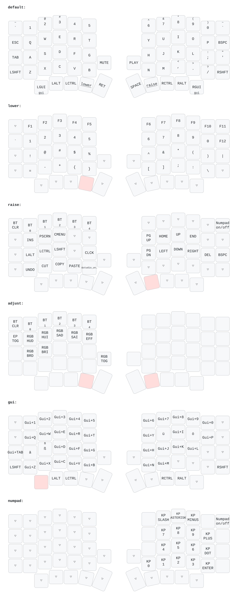

# Sofle Wireless — German-OS / US-feel ZMK config

Custom [ZMK](https://zmk.dev) firmware for the [Keebart Sofle Wireless](https://www.keebart.com/products/sofle-wireless) (board `sofle_choc_pro`).

**The idea:** keep your OS keyboard layout set to **German**, but type the **US-style characters** printed on your keycaps. The firmware sends the scancodes that a German OS turns back into the characters you actually want — so `y`/`z` land in the right place, `@ # { } [ ]` work as on a US layout, and you never have to fight OS-side layout tools.

> ⚠️ **Prerequisite:** your operating system's keyboard layout **must be German**. Everything here compensates for a German OS; on a US (or other) layout the output will be wrong.

## Features

- **US-feel typing on a German OS** — letters, number-row symbols, and punctuation come out as on a US layout.
- **Umlaut chord** — **hold** a `GUI` (Win) thumb key + `a` / `o` / `u` / `s` → `ä` / `ö` / `ü` / `ß` (add Shift for `Ä Ö Ü ẞ`). While the GUI key is held the board is on a GUI layer where every other key is its real Win shortcut (`Win+L`, `Win+E`, `Win+D`, `Win+1`…`0`, …). A quick **tap** of a GUI key alone = Start menu — so umlauts no longer pop the Start menu. (Trade-off: `Win+A`, `Win+S`, `Win+Shift+S` are unavailable.)
- **Raise layer** — `Home`/`End` next to the arrow cluster.
- **Numpad** — toggle layer: **Raise + top-right key** turns it on (it stays on); the same **top-right key** turns it off. While on, the right hand is a numpad and the left hand still types letters.
- **Adjust layer** — Bluetooth + RGB controls (hold `Lower`+`Raise`).
- **Dead-key helpers** — standalone `` ` `` `~` `^` via macros.

## Layout



*(Diagram generated with [keymap-drawer](https://github.com/caksoylar/keymap-drawer); see [`draw/`](draw/).)*

## Files

| Path | What it is |
|---|---|
| `config/sofle_choc_pro.keymap` | **The keymap** — the file you edit to change key behavior |
| `config/keys_de.h` | Vendored German locale keycodes ([zmk-locales](https://github.com/joelspadin/zmk-locales), MIT) |
| `config/sofle_choc_pro.conf` | Build-time options |
| `build.yaml` | Which firmware GitHub builds |
| `boards/`, `zephyr/` | Board definition (from [Keebart/zmk-config](https://github.com/Keebart/zmk-config)) |
| `draw/` | Layout diagram + the tooling that generates it |
| `docs/superpowers/` | Design spec & implementation plan |

## Build & flash

You don't need to install anything — GitHub builds the firmware for you.

1. **Build:** push to GitHub. The Actions workflow (`.github/workflows/build.yml`) compiles the firmware and, when it finishes (green ✓), attaches a **`firmware`** artifact under the run's *Artifacts* section. Download and unzip it to get:
   - `sofle_choc_pro_left-…uf2`
   - `sofle_choc_pro_right-…uf2`
2. **Flash each half:**
   - Set your OS keyboard layout to **German**.
   - Connect the **left** half by USB, **double-tap its reset button** → a USB drive appears → drag the `…left…uf2` file onto it. It reboots automatically.
   - Repeat for the **right** half with the `…right…uf2` file.
3. **Reconnect** Bluetooth and type away.

> If something ever goes wrong with pairing, the build also produces `settings_reset` firmware — flash that to both halves, then flash the normal firmware again.

## Changing the keymap

Edit `config/sofle_choc_pro.keymap`, commit, and push — GitHub rebuilds automatically. To regenerate the diagram after changes:

```bash
uvx --from keymap-drawer keymap -c draw/keymap_drawer.config.yaml parse \
  -z config/sofle_choc_pro.keymap -c 12 -o draw/sofle.yaml
python3 draw/relabel.py draw/sofle.yaml draw/sofle_fixed.yaml
uvx --from keymap-drawer keymap -c draw/keymap_drawer.config.yaml draw \
  -j config/sofle_choc_pro.json -l default_layout draw/sofle_fixed.yaml -o draw/sofle.svg
inkscape draw/sofle.svg --export-type=png --export-dpi=200 -o draw/sofle_keymap_german.png
```

## Credits

- Board definition & baseline config: [Keebart/zmk-config](https://github.com/Keebart/zmk-config)
- German locale keycodes: [joelspadin/zmk-locales](https://github.com/joelspadin/zmk-locales)
- Firmware: [ZMK](https://zmk.dev) · Diagram: [keymap-drawer](https://github.com/caksoylar/keymap-drawer)
